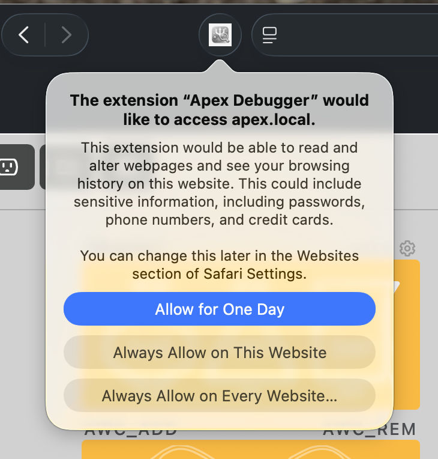
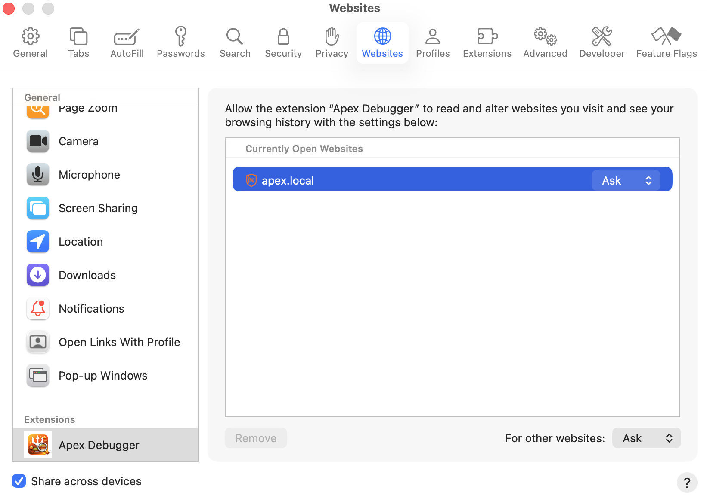

# Safari Installation (Mac)

> **Chrome users:** you can delete the `Apex Debugger.zip` file from the download — it's only needed for Safari.

## Step 1 — Install the app

1. Go to **[https://github.com/phatduckk/apex-debugger](https://github.com/phatduckk/apex-debugger)** and download the ZIP
2. In the unzipped folder, find **`Apex Debugger.zip`** and double-click it to unzip it
3. Drag the resulting **`Apex Debugger.app`** to your **Applications** folder
4. Double-click **`Apex Debugger.app`** to run it once — this registers the extension with Safari

## Step 2 — Enable the extension in Safari

1. Open **Safari** → **Settings** (`Cmd+,`) → click the **Extensions** tab
2. Find **Apex Debugger** in the left sidebar and check the checkbox to enable it

   

## Step 3 — Configure your Apex hostname

To change the hostname (e.g. if your Apex isn't at `apex.local`):

1. In the Extensions tab, click **Apex Debugger** in the sidebar
2. Click the **Settings** button (shown with the orange arrow in the screenshot above)
3. Enter your Apex controller's hostname or IP address and click Save

## Step 4 — Grant permissions

The first time you visit your Apex Fusion interface, Safari will show a prompt asking if the extension can access the site:

Choose **Always Allow on This Website** — this lets the extension read your Apex's live data on every visit without asking again.

If you need to adjust permissions later (for example, if your Apex is on a custom hostname or IP), open **Safari → Settings → Extensions → Apex Debugger** and click **Edit Websites...**. Find your Apex host (e.g. `apex.local`, or whatever IP/hostname you use) and set it to **Allow**.

## Updating

1. Download the latest ZIP from GitHub and unzip it
2. Inside the unzipped folder, find **`Apex Debugger.zip`** and double-click it to unzip it
3. Drag the new **`Apex Debugger.app`** to your **Applications** folder — click **Replace** when prompted
4. Double-click the app once to re-register the updated extension with Safari

Safari should automatically pick up the new version. If the extension shows as disabled after updating, go to **Safari → Settings → Extensions**, find Apex Debugger, and re-enable it. Your settings (hostname, etc.) are stored in Safari's extension storage and will be preserved across updates.
