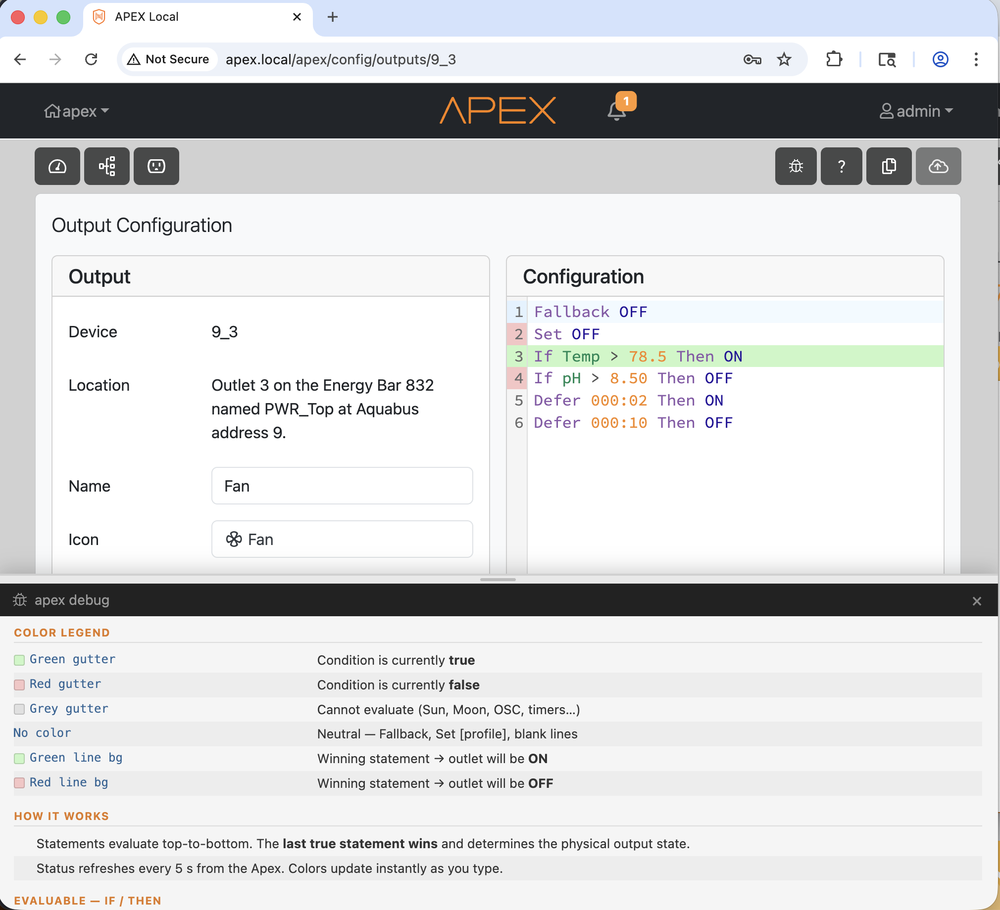
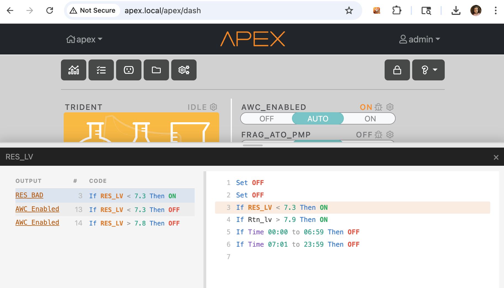
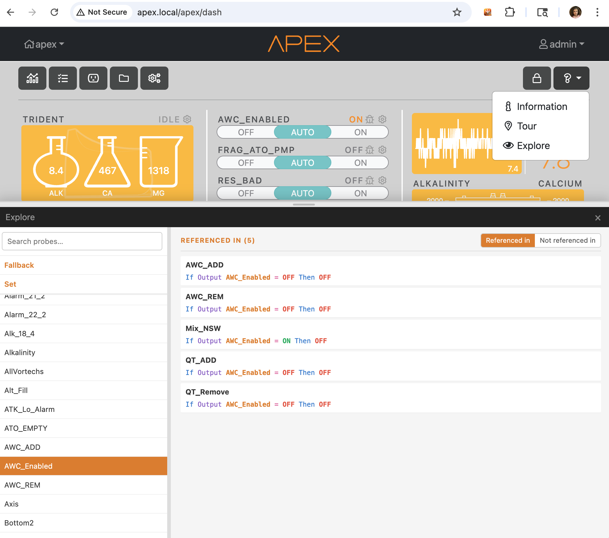
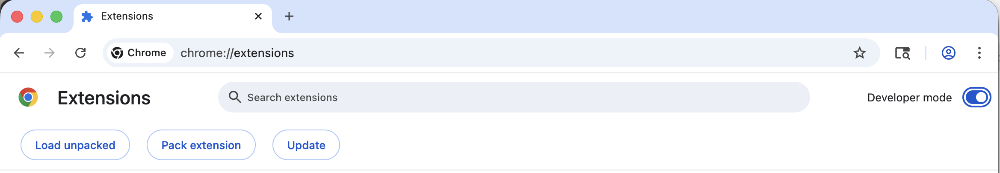
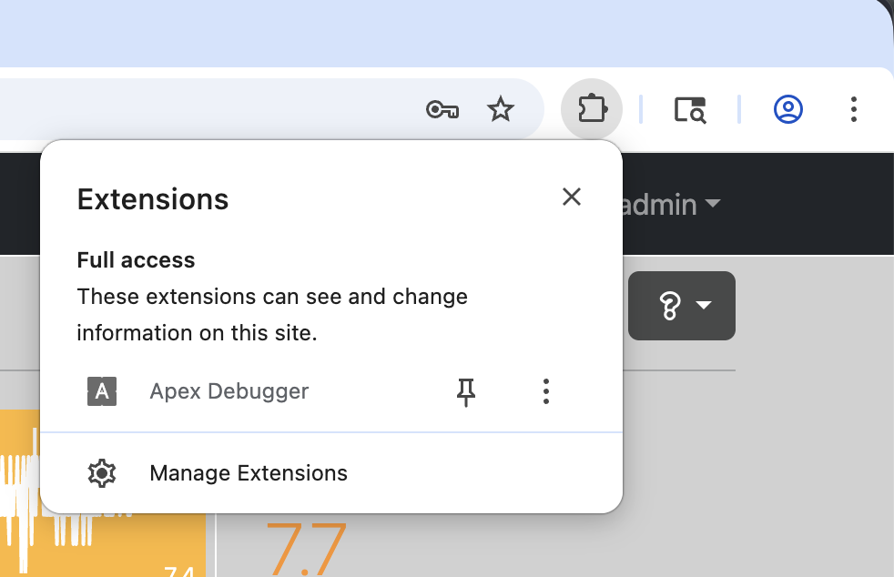
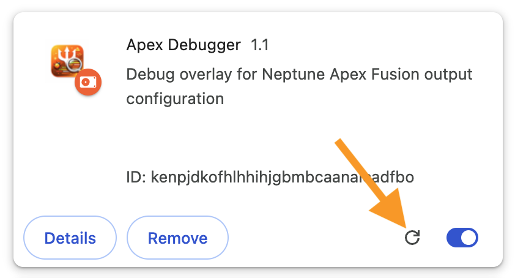
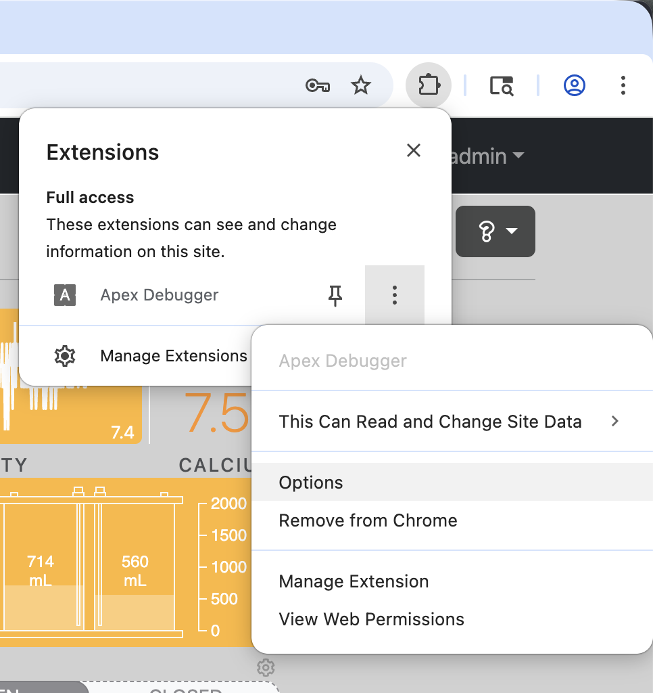
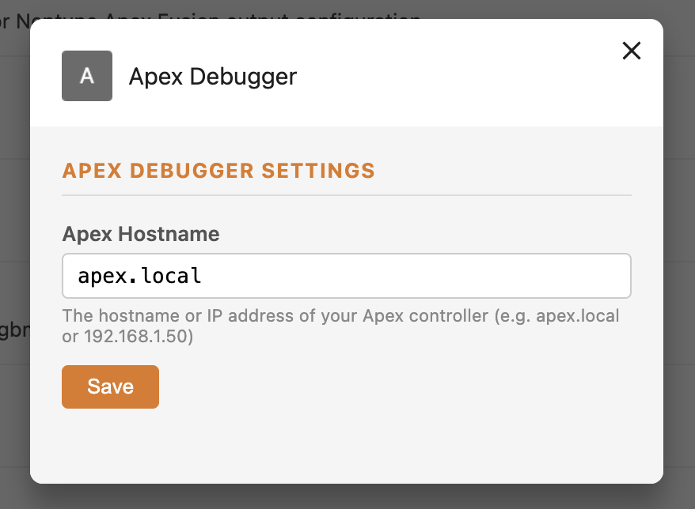

<p align="center">
  
</p>

# Apex Debugger

A Chrome extension that adds a **live debug overlay** to the [Neptune Apex Fusion](https://apex.local) output configuration editor. Each line of your outlet programming is color-coded in real time based on live data from your Apex controller — so you can instantly see which conditions are firing and which aren't.

---

## What It Does

When you're editing an outlet program in Apex Fusion, the extension reads your Apex's live status and highlights every line:

**Gutter** (line number column) — colored for every line:

| Gutter color | Meaning |
|---|---|
| 🟢 Green | Condition is currently **true** |
| 🔴 Red | Condition is currently **false** |
| ⬜ Grey | Can't be evaluated (e.g. `Min Time`, `When`, `OSC`) |
| _(no color)_ | Neutral statement (`Fallback`, `Set [profile]`, blank lines) |

**Line background** — highlighted only for the single winning statement (last true condition):

| Line color | Meaning |
|---|---|
| 🟢 Green background | Winning statement → outlet will be **ON** |
| 🔴 Red background | Winning statement → outlet will be **OFF** |

This makes it easy to understand your programs at a glance — especially complex multi-condition chains where the "last true statement wins" rule can be tricky to reason about.



### Supported Statement Types

The extension can evaluate:

- `If Time` — time ranges (including midnight-spanning)
- `If DOW` — day of week
- `If [PROBE] > / <` — temperature, pH, ORP, and any custom probe
- `If [INPUT] OPEN / CLOSED` — float switches and contact switches
- `If Output / If Outlet` — outlet state (ON/OFF)
- `If Output Percent` — variable output intensity
- `If FeedA / B / C / D` — active feed cycles
- `If Error` — outlet error state
- `Set ON / OFF` — always colored (green/red respectively)

Statements that require historical state (`Defer`, `Min Time`, `When`) and astronomical lookups (`If Sun`, `If Moon`, `If Temp < RT+`) are shown in grey — they can't be computed from a single status snapshot.

---

## Dashboard Usage Lookup

On the main dashboard (`/apex/dash`), every probe, outlet, and switch widget shows a small bug icon next to its settings cog. Clicking it opens a panel showing every outlet whose program references that item — so you can instantly see what depends on it without hunting through your config manually.



Each row links directly to that outlet's configuration page. Click a row to see the full outlet program in the right pane, with the matching line highlighted.

---

## Explore: Find Where Probes Are Used

The **Explore** panel lets you browse every probe in your config and see at a glance which other outlets reference it — or don't.

Open it from the **`?` help menu** in the top toolbar of the dashboard and select **Explore**.



The panel has two columns:

- **Left — probe list**: every probe from your config, listed alphabetically. `Fallback` and `Set` are pinned at the top as special keywords. Type in the search box to filter the list.
- **Right — references**: click any probe to see which other outlets reference it in their programming, with the matching line of code shown and syntax-highlighted. Each entry links directly to that outlet's config page.

Use the **Referenced in / Not referenced in** toggle to flip the view and see which outlets *don't* reference the selected probe — useful for finding orphaned probes or outlets that are missing a dependency.

---

## Installation

You'll download the extension files from GitHub and load them manually into Chrome. This takes about two minutes.

### Step 1 — Download the extension

1. Go to **[https://github.com/phatduckk/apex-debugger](https://github.com/phatduckk/apex-debugger)**
2. Click the green **`< > Code`** button near the top right
3. Click **Download ZIP**
4. Once downloaded, **unzip** the file — on Mac, double-click it; on Windows, right-click → _Extract All_
5. You should now have a folder called **`apex-debugger-main`** (or similar). Move it somewhere you won't accidentally delete it (e.g. your Documents folder)

### Step 2 — Load it into Chrome

1. Open **Google Chrome**
2. In the address bar, type `chrome://extensions` and press Enter
3. In the top-right corner of that page, turn on **Developer mode** (toggle switch)
4. Click the **Load unpacked** button that appears

   

5. Navigate to the `apex-debugger-main` folder you unzipped and select it
6. The **Apex Debugger** extension will appear in your list — click **Enable** if it isn't already active

   

> **Note:** The extension only runs while it's loaded here. Don't delete the folder after installing or Chrome will lose track of it.

### Updating the extension

When a new version is available:

1. Download the latest ZIP from GitHub (same link as above) and unzip it
2. Replace the files in your existing `apex-debugger-main` folder with the new ones
3. Go to `chrome://extensions` and click the **refresh icon** on the Apex Debugger card to reload it

   

That's all — no need to re-add or reconfigure anything.

---

## Setting Your Apex Hostname

The extension needs to know the address of your Apex controller on your local network. By default it tries `apex.local`, which works for most setups — but if your controller is on a different hostname or IP address, you'll need to update this.

### How to change the hostname

1. In Chrome, click the **puzzle piece icon** (🧩) in the top-right toolbar to open your extensions list
2. Find **Apex Debugger** and click the **three-dot menu** (⋮) next to it
3. Click **Options**

   

4. A small settings panel will appear — in the **Apex Hostname** field, enter your controller's hostname or IP address:

   

   - Most users: `apex.local`
   - If you know your controller's IP: e.g. `192.168.1.50`

5. Click **Save** (or press Enter)

You can find your Apex's IP address in your router's admin panel, or in the Fusion app under **System → Network**.

---

## Usage

1. Log in to your Apex Fusion interface in Chrome
2. Navigate to any outlet and open its **programming editor**
3. The debug overlay activates automatically — each program line is highlighted based on the current live state of your system
4. The overlay refreshes every **5 seconds**

That's it. No buttons to click, no extra steps.

---

## Troubleshooting

**Lines aren't getting colored / overlay isn't showing**
- Make sure you're viewing an outlet program in the Fusion editor (not the main dashboard)
- Check that your hostname is set correctly (see the [Setting Your Apex Hostname](#setting-your-apex-hostname) section above)
- Open Chrome DevTools (`Cmd+Option+I` on Mac, `F12` on Windows) → Console tab, and look for any errors mentioning `apex-debugger`

**All lines are grey**
- The extension couldn't reach your Apex controller. Double-check the hostname in Options and make sure your computer is on the same network as your Apex.

**The extension disappeared after a Chrome update**
- Chrome sometimes disables unpacked extensions after updates. Go to `chrome://extensions`, find Apex Debugger, and click **Enable**.

---

## Project Structure

```
apex-debugger/
├── manifest.json      # Extension metadata and permissions
├── content.js         # Core logic: polling, evaluation, overlay rendering
├── options.html       # Settings UI
├── options.js         # Settings save/load
└── APEX_GRAMMAR.md    # Reference doc for Apex programming language grammar
```

---

## License

MIT

---

## ETC

Yup - Claude did all this. Took no time. Neptune should really try harder =)
