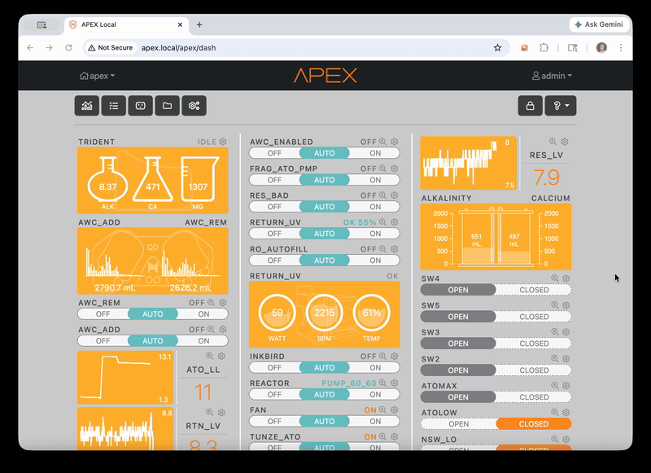
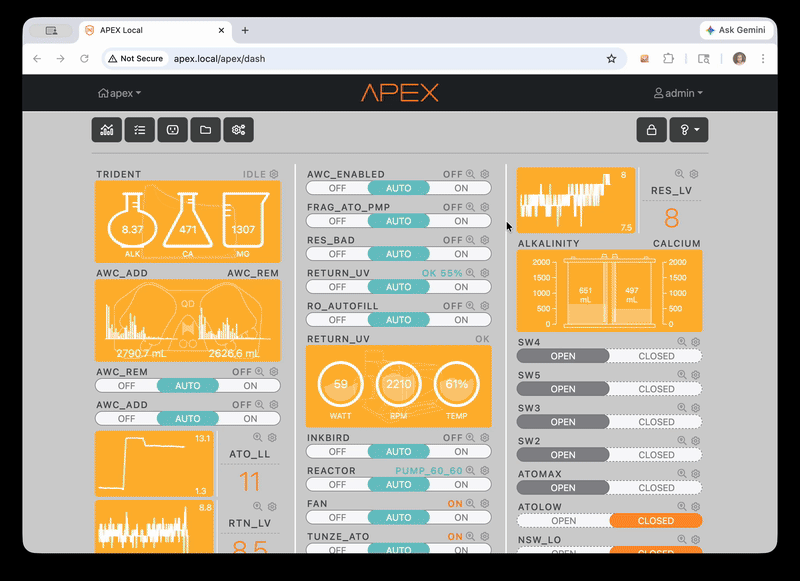
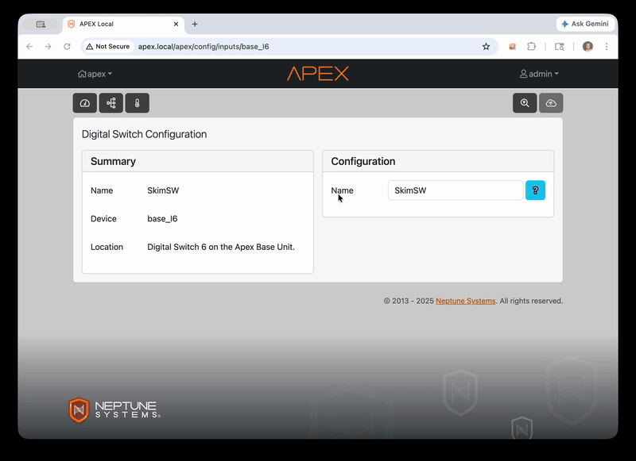
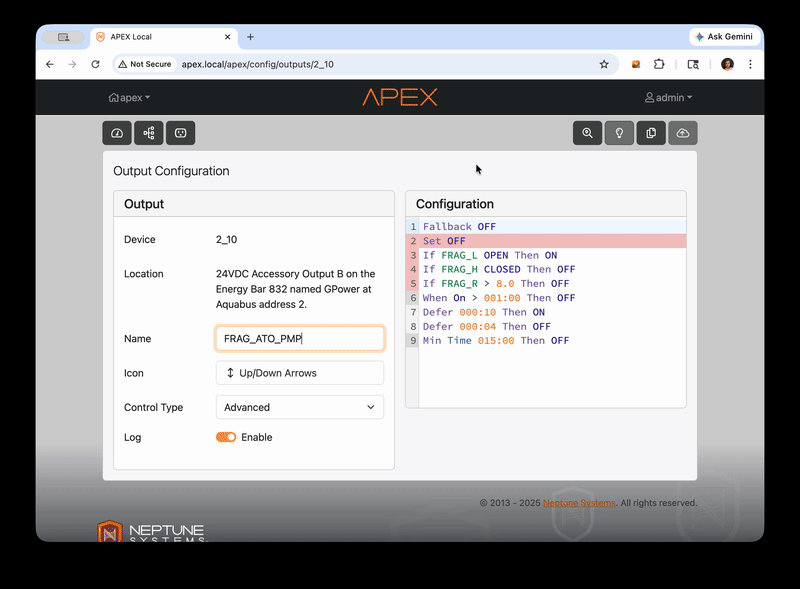

<p align="center">
  
</p>

# Apex Debugger

A browser extension for **Chrome and Safari** that adds useful features to [Apex Fusion](https://apex.local). It works by connecting directly to your Apex controller on your local network — so it needs access to `apex.local` (or whatever hostname your controller uses) to read live status and configuration data.

---

## Features

### Unused Widgets Filter

The dashboard has a section at the bottom for widgets that aren't assigned to any tile. The extension adds a filter bar to that section so you can quickly find widgets by name or type without scrolling through the whole list.

<p align="center"></p>

---

### Dashboard References

Every probe, input, and output widget on the dashboard gets a magnifier icon next to its settings cog. Click it and a panel slides up showing every outlet whose program references that item — with the exact matching line of code for each one.

<p align="center"></p>

Click any line of code in the panel to expand it into the full outlet program on the right, with the matching line highlighted. Click the outlet name to jump directly to its edit page.

---

### Explore

Explore is like the dashboard references panel but for your entire config at once. Open it from the **`?` menu** in the dashboard toolbar and select **Explore**.

<p align="center"></p>

The left column lists every input, output, and probe in your config. Click any item to see which outlets reference it in the right column — with the matching line of code shown for each. Use the **Referenced in / Not referenced in** toggle to flip the view and find everything that *doesn't* reference the selected item, useful for finding orphaned probes or missing dependencies.

You can search the left column to filter the list. `Fallback` and `Set` are included at the top as a convenience since they appear frequently in outlet programs.

---

### Code Debugger

When you open an outlet's programming editor, the extension automatically color-codes every line based on your Apex's current live state — no button to click, no refresh needed. It updates as you edit.

<p align="center"></p>

**Gutter** (line number column) — colored for every line:

| Color | Meaning |
|---|---|
| 🟢 Green | Condition is currently **true** |
| 🔴 Red | Condition is currently **false** |
| ⬜ Grey | Can't be evaluated (e.g. `Min Time`, `When`, `OSC`) |
| _(no color)_ | Neutral (`Fallback`, `Set [profile]`, blank lines) |

**Line background** — highlighted only for the winning statement (last true condition):

| Color | Meaning |
|---|---|
| 🟢 Green background | Outlet will be **ON** |
| 🔴 Red background | Outlet will be **OFF** |

Hover over any gutter marker for more detail. The overlay updates immediately as you change code.

---

### References from Output & Input Pages

The same references panel available on the dashboard is also accessible directly from any output or input configuration page. Click the magnifier icon in the toolbar and a panel shows every outlet that references the current item — with the same line-of-code view and full-program preview.

<p align="center"></p>

---

### Legend

Click the **lightbulb icon** in the toolbar on any output or input page to open the legend panel.

<p align="center"></p>

The legend explains how the code debugger works, shows which statement types the extension can and can't evaluate, and includes a coding reference to help you write new outlet programs.

---

## Installation, Upgrading & Settings

- [Chrome Installation](INSTALL_CHROME.md)
- [Safari Installation](INSTALL_SAFARI.md)
- [Settings](SETTINGS.md)
  - *Change your Apex hostname and enable Beef Mode*

---

## Troubleshooting

**Lines aren't getting colored / overlay isn't showing**
- Make sure you're viewing an outlet program in the Fusion editor (not the main dashboard)
- Check that your hostname is set correctly (see [Setting Your Apex Hostname](#setting-your-apex-hostname) above)
- Open browser DevTools (`Cmd+Option+I` on Mac) → Console tab, and look for any errors mentioning `apex-debugger`

**All lines are grey**
- The extension couldn't reach your Apex controller. Double-check the hostname in Options and make sure your computer is on the same network as your Apex.

**The extension disappeared after a Chrome update**
- Chrome sometimes disables unpacked extensions after updates. Go to `chrome://extensions`, find Apex Debugger, and click **Enable**.

---

## Project Structure

```
apex-debugger/
├── manifest.json      # Extension metadata and permissions
├── content.js         # Core logic: polling, evaluation, overlay rendering
├── options.html       # Settings UI
├── options.js         # Settings save/load
└── APEX_GRAMMAR.md    # Reference doc for Apex programming language grammar
```

---

## Peeps We Dig

**Reef Beef** — [Official Site](https://reefbeefpodcast.com) — [YouTube](https://www.youtube.com/c/ReefBeefPodcast)

**High Tide Aquatics** — [hightideaquatics.net](https://www.hightideaquatics.net)

**Bay Area Reefers** — [bareefers.org](https://www.bareefers.org/forum/)

**Aquatic Collection** — [aquaticcollection.com](https://aquaticcollection.com)

**Neptune Aquatics** — [neptuneaquatics.com](https://www.neptuneaquatics.com)

[Thanks for the feedback Tangdora](https://www.reef2reef.com/members/tangdora.142148/)

---

## ETC

Yup - Claude did all this. Took no time. Neptune should really try harder =)

---

## License

MIT
