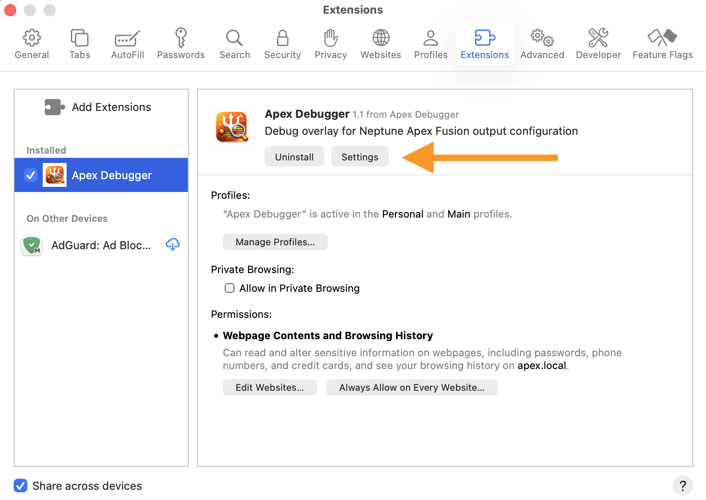
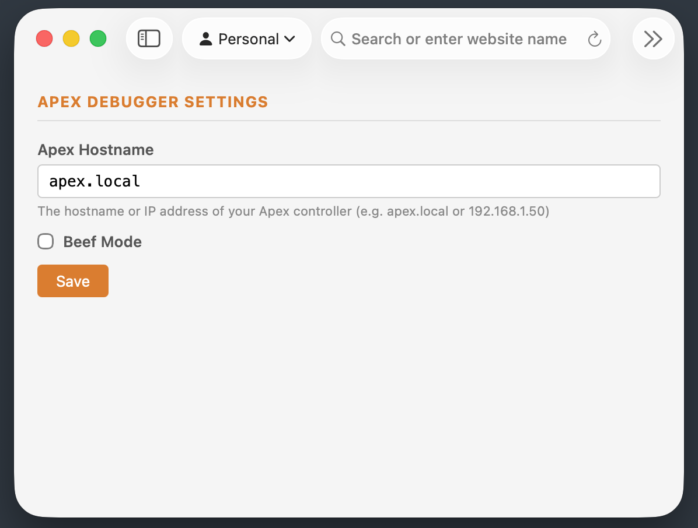

# Settings

## Setting Your Apex Hostname

The extension needs to know the address of your Apex controller on your local network. By default it tries `apex.local`, which works for most setups — but if your controller is on a different hostname or IP address, you'll need to update this.

You can find your Apex's IP address in your router's admin panel, or in the Fusion app under **System → Network**.

### Chrome

1. Click the **puzzle piece icon** (🧩) in the top-right toolbar to open your extensions list
2. Find **Apex Debugger** and click the **three-dot menu** (⋮) next to it
3. Click **Options**

   

4. A small settings panel will appear — in the **Apex Hostname** field, enter your controller's hostname or IP address:

   

   - Most users: `apex.local`
   - If you know your controller's IP: e.g. `192.168.1.50`

5. Click **Save** (or press Enter)

### Safari

1. Open **Safari → Settings** (`Cmd+,`) → **Extensions** tab
2. Click **Apex Debugger** in the sidebar, then click the **Settings** button (highlighted with the orange arrow)

   

3. The settings page will open — enter your controller's hostname or IP in the **Apex Hostname** field:

   

   - Most users: `apex.local`
   - If you know your controller's IP: e.g. `192.168.1.50`

4. Click **Save**
